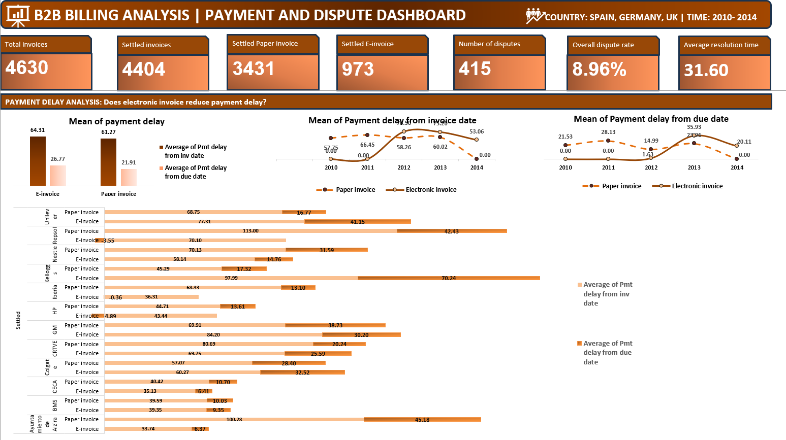
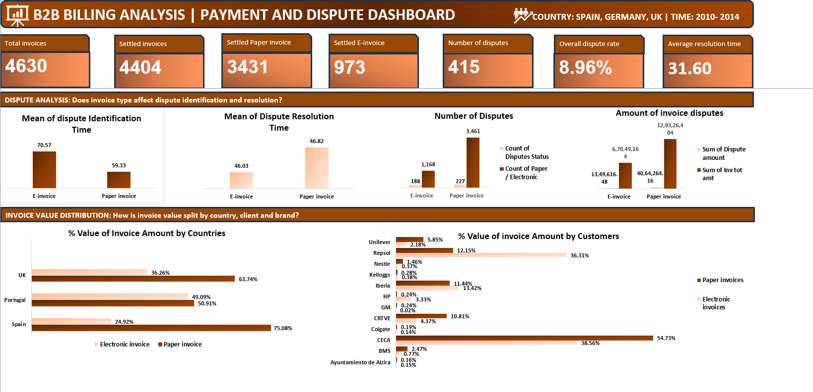

# 📊 B2B Invoice Payment Behaviour Analysis

> **An Excel-based business analytics project examining the impact of electronic invoicing on payment delays, dispute patterns, and revenue collection across Spain, Germany, and the UK (2010–2014)**

---

## 📌 Project Overview

This project analyzes B2B billing data for **ABC Ltd.** to evaluate whether the transition from paper invoices to electronic invoices led to measurable improvements in payment behaviour, dispute management, and revenue collection. The analysis spans **4,630 invoices** across three countries and twelve major clients over five years.

---

## 🖼️ Dashboard Preview

### Payment Delay Analysis


### Dispute & Revenue Distribution Analysis


---

## 📁 Project Structure

```
B2B-Invoice-Payment-Behaviour/
│
├── README.md
├── dashboard1.png
├── dashboard2.png
└── B2B_Invoice_Analysis.xlsx        # Source data + Excel dashboard
```

---

## 🔢 Key Metrics at a Glance

| Metric | Value |
|---|---|
| Total Invoices | 4,630 |
| Settled Invoices | 4,404 |
| Settled Paper Invoices | 3,431 |
| Settled E-Invoices | 973 |
| Number of Disputes | 415 |
| Overall Dispute Rate | 8.96% |
| Average Resolution Time | 31.60 days |

---

## 🔍 Research Questions & Findings

### Q1. Does electronic invoicing reduce payment delay?

**Overall comparison (mean payment delay):**

| Invoice Type | PD from Invoice Date | PD from Due Date |
|---|---|---|
| Paper Invoice | 61.27 days | 21.91 days |
| E-Invoice | 64.31 days | 26.77 days |
| Change | +3.04 days | +4.86 days |

> **Finding:** Clients pay paper invoices faster overall. E-invoices introduced additional delays, particularly during the 2012–2013 transition period.

---

**Year-wise trend (PD from Invoice Date):**

| Year | Paper Invoice | E-Invoice |
|---|---|---|
| 2010 | 57.75 | — |
| 2011 | 66.45 | — |
| 2012 | 58.26 | 76.50 |
| 2013 | 60.02 | 75.20 |
| 2014 | — | 53.06 |

> **Finding:** Significant delay during transition years (2012–2013); by 2014, e-invoice PD improved notably but data is not directly comparable.

---

**Client-wise outcomes:**

| Client | Outcome |
|---|---|
| Ayuntamiento de Alzira | ✅ Strong improvement |
| Iberia | ✅ Strong improvement |
| Repsol | ✅ Major improvement |
| HP | ✅ Clear improvement |
| Nestle | ✅ Consistent improvement |
| CECA | 🔶 Moderate improvement |
| BMS | ➖ No significant change |
| CRTVE, GM | 🔀 Mixed effect |
| Colgate | ❌ Delay worsened |
| Kelloggs | ❌ Significant worsening |
| Unilever | ❌ Significant worsening |

---

### Q2. Is there a positive impact on disputes post-enablement?

| Metric | Paper Invoice (Pre) | E-Invoice (Post) | Change |
|---|---|---|---|
| Number of Disputes | 227 / 3,461 = **6.5%** | 188 / 1,168 = **16%** | +9.54% |
| Value of Disputes | ₹40,64,264.16 (3.14%) | ₹13,49,616.48 (2.01%) | -1.13% |
| Dispute Identification Time | 59.32 days | 70.57 days | +11.25 days |
| Dispute Resolution Time | 46.82 days | 46.03 days | -0.78 days |

> **Finding:** While dispute volume increased significantly post-enablement, the monetary value of disputes decreased. Identification time worsened, but resolution time improved marginally.

---

### Q3. Are there notable correlations between electronic invoicing and revenue collection?

**Country-wise:**

| Country | E-Invoice % | Paper Invoice % |
|---|---|---|
| Spain | 24.92% | 75.08% |
| Portugal | 49.09% | 50.91% |
| UK | 36.26% | 63.74% |

> Spain shows the highest overall paper invoice dependency; UK and Portugal show more balanced adoption.

**Client-wise highlights:**
- 📈 Higher e-invoice revenue: **Repsol, Iberia, HP, Kelloggs**
- 📉 Higher paper invoice revenue: **CECA, CRTVE, BMS, Nestle, GM, Unilever**
- ➖ Similar from both: **Ayuntamiento de Alzira, Colgate**

**Brand/Revenue type highlights:**
- **GTS** is the highest-revenue method for both invoice types
- **VAR and NCU** show higher e-invoice revenue
- **GBS, MAN, RER** show significantly higher paper invoice revenue

---

## 💡 Recommendations

1. **Improve e-invoice generation efficiency** — streamline the workflow to reduce delays introduced during digitization.
2. **Train clients and internal teams** — structured onboarding for clients unfamiliar or uncomfortable with electronic invoicing.
3. **Offer incentives** — discounts or priority service for clients who consistently adopt e-invoicing.
4. **Implement automated error checks** — reduce disputes by sending error-free invoices.
5. **Set clear dispute resolution timelines** — standardize SLAs to prevent unnecessary delays.
6. **Identify chronic late-payers** — review credit terms and automate payment reminders for high-risk accounts.
7. **Collect client feedback** — understand barriers to e-invoice adoption at the client level.

---

## 🛠️ Tools Used

| Tool | Purpose |
|---|---|
| **Microsoft Excel** | Data cleaning, pivot tables, dashboards |
| **Power Query** | Data transformation and merging |
| **Excel Charts** | Bar charts, line charts, KPI cards |

---

## 👩‍💻 Author

**Soumi Maiti**  
MBA Candidate — Business Analytics & Systems Management  
IISWBM Kolkata  
[LinkedIn](www.linkedin.com/in/soumi-maiti-2k26)

---

## 📄 License

This project is for academic purposes only. Data is proprietary to the course assignment.
